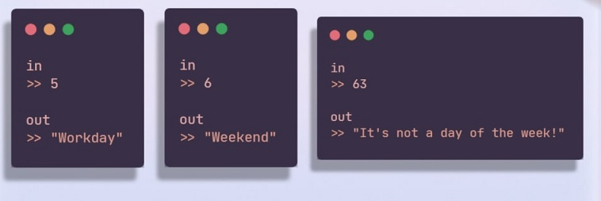
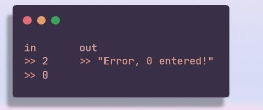
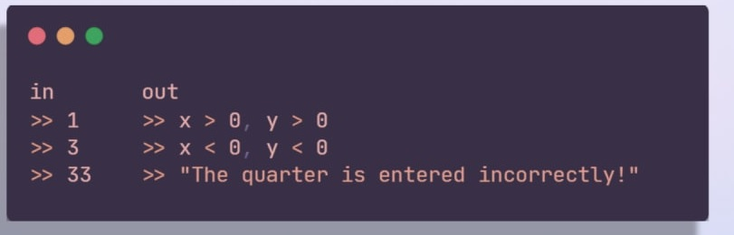

# SeminarPY001.

### Задание 1. Написать программу, которая принимает на вход два числа и проверяет, является ли одно число квадратом другого.

### Задание 2. Написать программу, которая будет принимать на вход дробь и показать первую цифру дробной части числа.

### Задание 3. Написать программу, которая принимает на вход число и проверяет, кратно ли оно 5 и 10 или 15, но не 30.

### Задание 4. Написать программу, которая принимает на вход цифру, обозначающую день недели, и проверяет, является ли этот день выходным.

### Задание 5. Написать программу, которая проверяет истиность утверждения !(X or Y or Z)=!X and !Y and !Z.

### Задание 6. Написать программу, которая принимает на вход координаты точки (X и Y), причем X !=0 и Y !=0 и выдает номер четверти плоскости, в которой находится эта точка (или на какой оси она находится).

### Задание 7. Написать программу, которая по заданному номеру четверти, показывает диапозон возможных координат точек в этой четверти (X и Y).

### Задание 8. Написать программу, которая принимает на вход координаты двух точек и находит расстояние между ними в пространстве.

